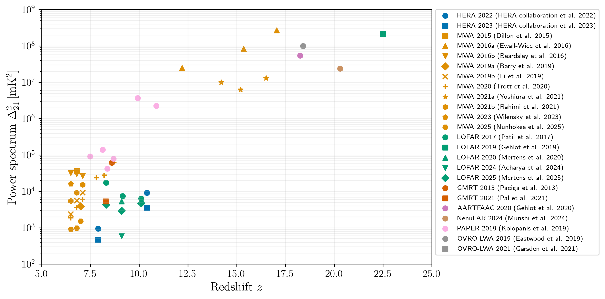

# 21-cm power spectrum limits
This repository contains the latest upper limits on the 21-cm power spectrum from various experiments, inspired by a similar (now outdated) collection [PabloVD/21cmBounds](https://github.com/PabloVD/21cmBounds) and a private repository with updated limits by [ThomasGesseyJones](https://github.com/ThomasGesseyJones).

This is intended to be a living document and I will updated this as and when possible. There is a Python script included that reads the limits and generates the plot below, which contains all the limits included:

# Usage and license
The code can be freely used for any purpose. Acknowledgment is appreciated but not required. If you find any errors or missing limits, please open an issue, pull request, or contact me directly at [jitendhandha@gmail.com](mailto:jitendhandha@gmail.com).