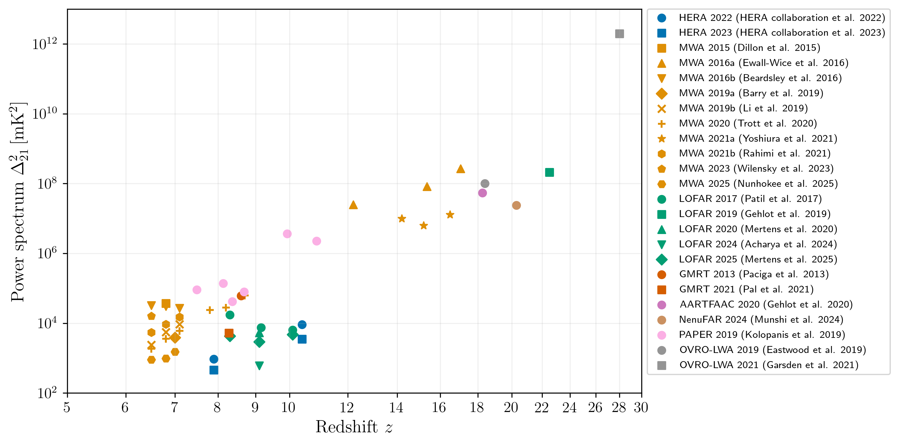

# 21-cm power spectrum limits

*Last updated: 20 May 2025*

This repository contains the latest upper limits on the 21-cm power spectrum from various experiments, inspired by similar now outdated collections ([PabloVD/21cmBounds](https://github.com/PabloVD/21cmBounds), [ThomasGesseyJones](https://github.com/ThomasGesseyJones)). The list is intended to be a living document and I will updated it as and when possible. There is a Python script included that reads the data and generates the plot shown below, or you can use the GUI via `python gui.py`. 

## Requirements
The code is written in Python 3+. You will need the following packages:
- `numpy`
- `matplotlib`
- `pandas`

If you want to use the GUI, you will also need:
- `plotly`
- `seaborn`
- `nicegui`

## File format 

Each limit is stored in a separate file, with the filename indicating the experiment and year. The header of each file contains a reference to the corresponding paper, and the data is stored in a simple format of: $z$, $k~(h\text{Mpc}^{-1})$, $\Delta_{21}^2~(\text{mK}^2)$.

## Usage and license
The code can be freely used for any purpose. Acknowledgment is appreciated but not required. If you find any errors or missing limits, please open an issue, pull request, or contact me directly at [jitendhandha@gmail.com](mailto:jitendhandha@gmail.com).